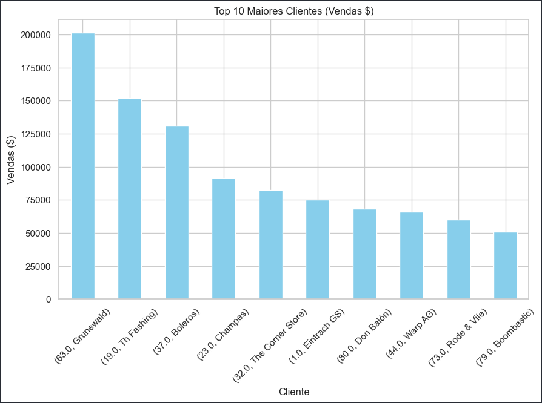
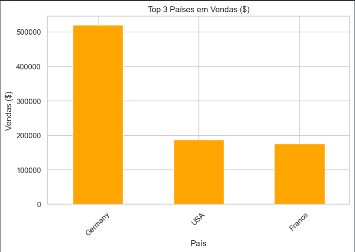
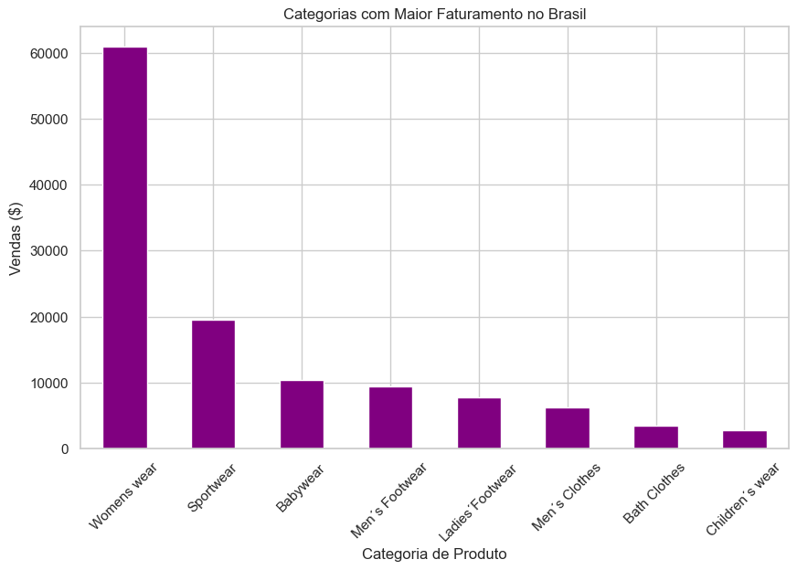
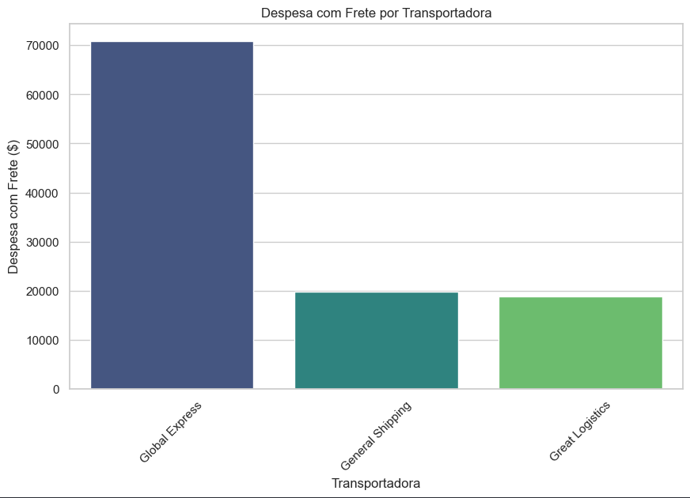
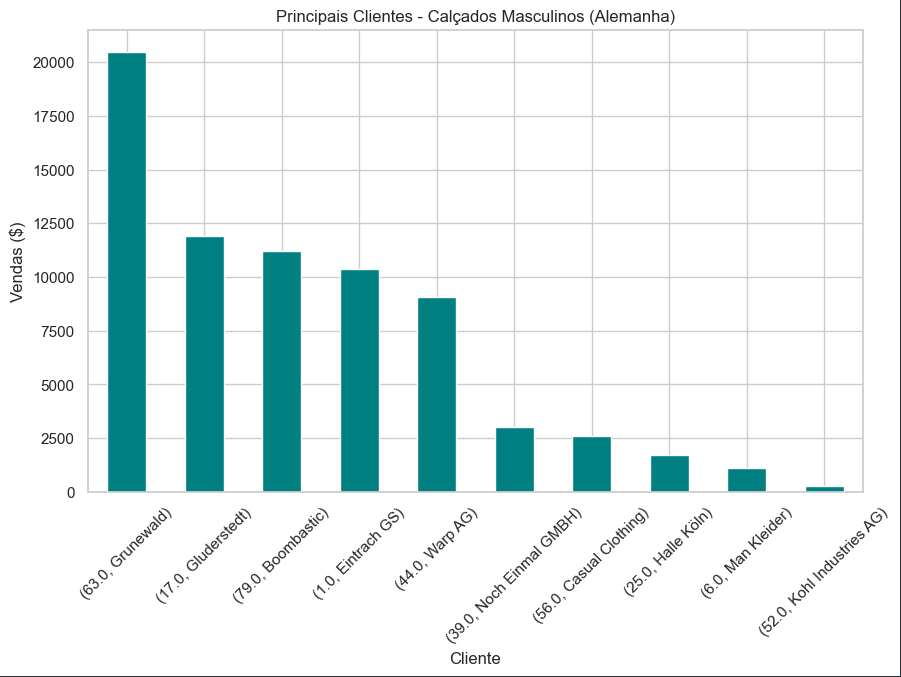
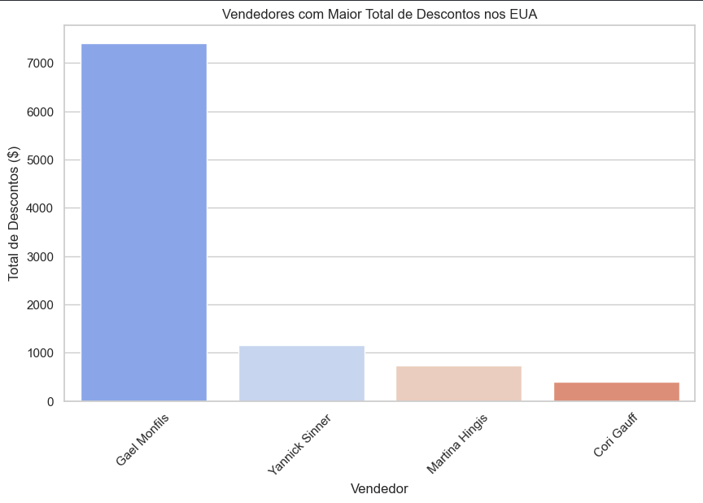
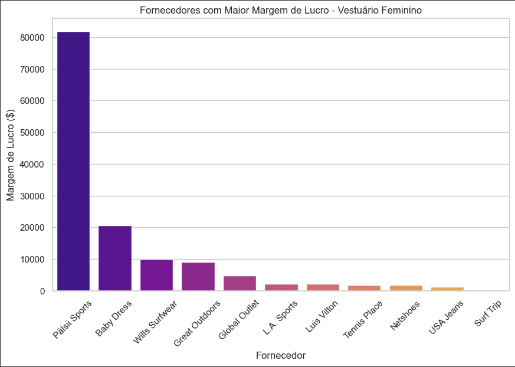
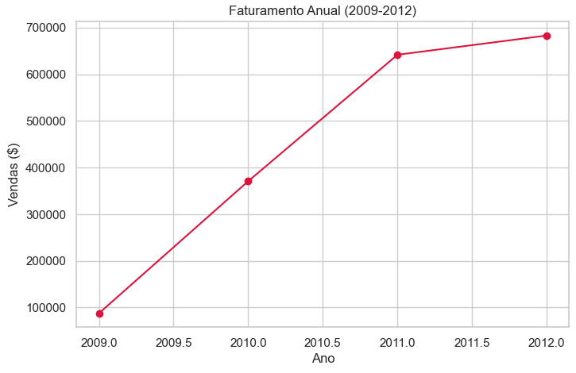
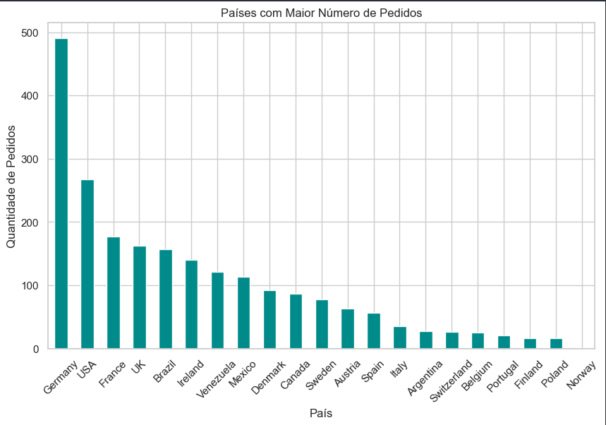

# Relatório de Análise de Dados - Departamento de Vendas

**Equipe:** Amanda Cruz, Brian Rafael, George Lima  
**Data:** 02/11/2024  
**Tempo total gasto(valor aproximado):** Aproximadamente 45 minutos.

---

## 1. Introdução

Este relatório apresenta as respostas para as questões de negócios solicitadas pelo Departamento de Vendas, assim como uma visão geral das estratégias, tecnologias utilizadas e o tempo gasto em cada etapa para a obtenção dos resultados.

---

## 2. Respostas para as Perguntas

1. **Quem são os meus 10 maiores clientes, em termos de vendas ($)?**

   

2. **Quais os três maiores países, em termos de vendas ($)?**
   
   

3. **Quais as categorias de produtos que geram maior faturamento (vendas $) no Brasil?**
   
   

4. **Qual a despesa com frete envolvendo cada transportadora?**
   
   

5. **Quais são os principais clientes (vendas $) do segmento “Calçados Masculinos” (Men’s Footwear) na Alemanha?**
   
   

6. **Quais os vendedores que mais dão descontos nos Estados Unidos?**
   
   

7. **Quais os fornecedores que dão a maior margem de lucro ($) no segmento de “Vestuário Feminino” (Womenswear)?**
   
   

8. **Quanto foi vendido ($) no ano de 2009? O faturamento entre 2009 e 2012 mostra crescimento, estabilidade ou declínio?**
   
   

9. **Quais os países com maior quantidade de pedidos (qtde total de pedidos)?**
   
   

---

## 3. Estratégia e Tecnologias Utilizadas

### 3.1 Estratégia de Análise

1. **Análise de Requisitos:**
   - Mapeamento dos dados necessários e identificação das colunas a serem analisadas.

2. **Estratégia de Filtragem e Agrupamento:**
   - Uso de filtros condicionais para identificar os segmentos específicos.
   - Agrupamento de dados com base em chaves como `ClienteID`, `CategoriaNome`, `ClientePaís`, etc., para calcular métricas agregadas.

### 3.2 Tecnologias Utilizadas

- **Python**: Linguagem principal para análise e manipulação dos dados.
  - **Pandas**: Processamento e manipulação de dados para filtragem e agrupamento.
  - **Matplotlib & Seaborn**: Criação de gráficos e visualizações dos resultados.

- **Jupyter Notebook**: Ambiente para organização de código e visualização em tempo real dos resultados.

---

## 4. Tempo Gasto em Cada Etapa

| Etapa                               | Tempo Gasto          |
|-------------------------------------|----------------------|
| Análise de Requisitos               | 15 minutos          |
| Preparação de Infraestrutura        | 10 minutos          |
| Implementação da Solução            | 1 hora              |
| Análise e Geração de Respostas      | 5 minutos           |
| Criação das Visualizações           | 3 minutos           |
| Revisão e Preparação da Apresentação| 20 minutos          |
| **Total**                           | 1 hora e 43 minutos |

---